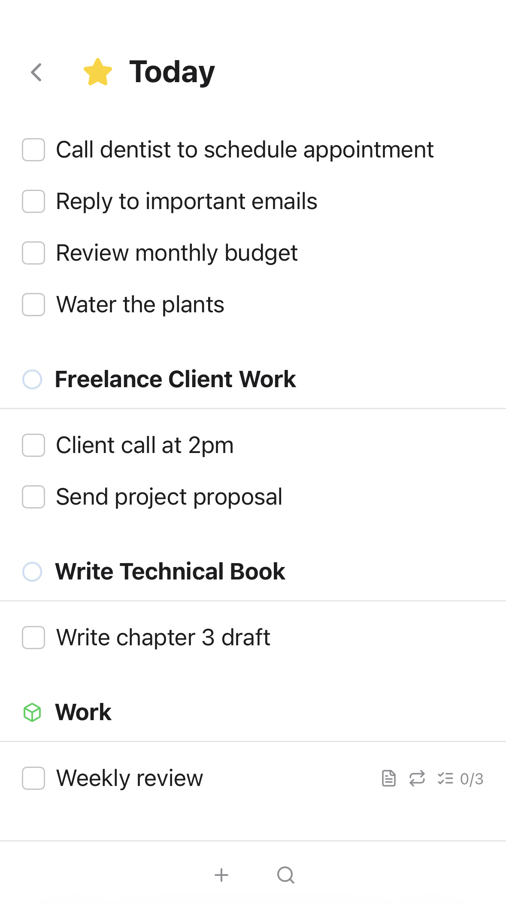

# Things

My own task management app **inspired** by Things, built with TanStack Start, Drizzle and React.

This is vibecoded so use at your own risk. I built it and self-hosted it for my own personal use.

## Screenshots

<table>
  <tr>
    <td></td>
    <td></td>
  </tr>
</table>

## Why?

Things is pretty much perfect and I have used it for more than a decade.
But it only runs in Apple devices, as I move into Linux I always dreamt of a
Web version plus a CLI and API to build integrations.
So I vibecoded this one.

## Docker

```bash
docker run -p 3000:3000 -v things-data:/data -e BASE_URL=https://mythings.local -e BETTER_AUTH_SECRET=<better-auth-secret> ghcr.io/danielfrg/things:main
```

## CLI

The CLI allows you to interact with the Things REST API from the command line.

Install the CLI binary:
- This installs to `~/.things/bin/things`. Be sure to add to your `PATH`.

```bash
curl -fsSL https://raw.githubusercontent.com/danielfrg/things/main/install | bash
```

Generate an API from the settings page and export these environment variables:

```bash
export THINGS_API_BASE_URL=http://things.local/api  # Default: http://localhost:3000
export THINGS_API_KEY=sk_...
```

### Usage

```bash
things tasks list --json
things tasks add --title "Buy groceries" --json
things tasks complete <task-id>
things --help
```

For AI agents, run `things --skill` to get full documentation.

## Development

```bash
cp .env.example .env
bun install
bun run db:push
bun run db:seed     # Optional
bun run dev
```

## Contributions

Everything, human or AI, contributions are welcome since I dont even know about this code. Whatever forever.

## Disclaimer

This has nothing to do with Things or CulturedCode.
